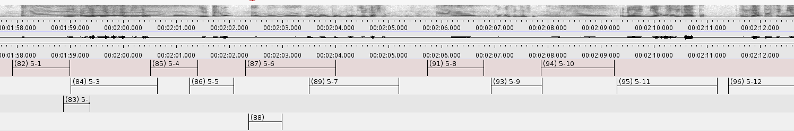
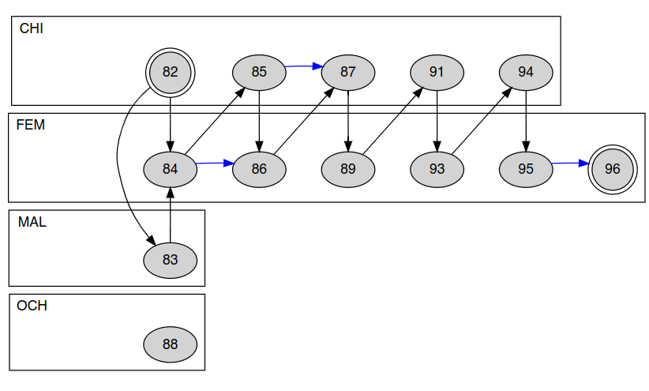

# Conversations

`conversations` is a tool that helps you find interactional sequences from a collection of annotated time-stamped segments.

Interactional sequences are represented as an oriented graph, where segments are connected to one another if they fall within a given timespan.

## From segments to graphs

Here is an example of annotated segments that belong to different speakers (CHI, FEM, MAL, and OCH) visualised using ELAN.

Here is a representation of a graph that shows how segments belonging to different speakers are connected together. Blue arrows denote multi-turn units belonging to a same speaker, while black arrows show _potential_ turn transitions from a speaker to another. 
