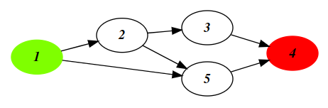
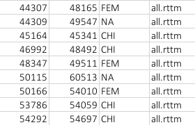
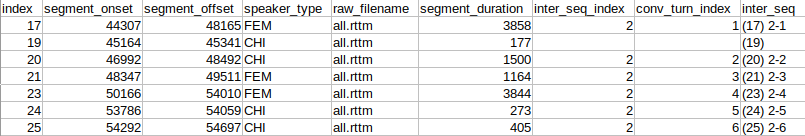
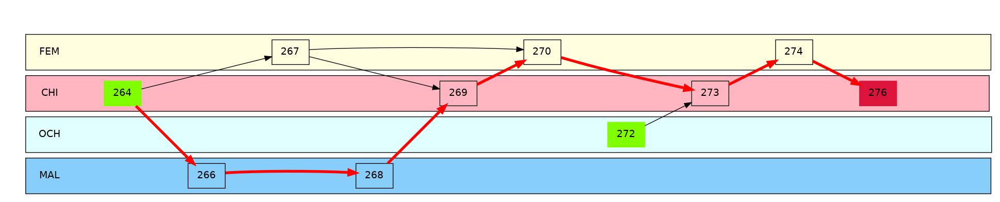
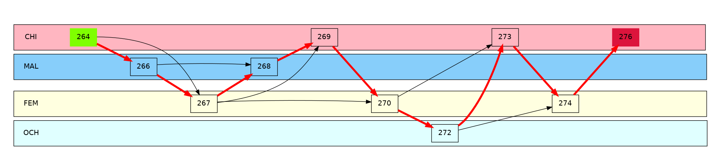

# Conversations

The `conversations` package is a tool that helps you find interactional sequences from a collection of time-stamped spoken data. This package was inspired by the [`chattr`](https://github.com/marisacasillas/chattr-basic) package for R. Just like `chattr`, our tool aims at finding interactional sequences from tabular data. We strove to build our package around three design principles:

* efficient computational approach: directed acyclic graphs (DAGs)
* customisibility
* simple and easy-to-read output (including a visual output!)

## Terminology

### Conversational Analysis

TODO

### Directed Acyclic Graphs

Directed Acyclic Graphs (or DAGs for short) form the backbone of our application. DAGs offer a theoretically grounded way to represent conversational data. In a DAG (see below), **nodes** (e.g. 1, 2, 3, 4, and 5) are connected to one another by **edges** (black arrows). These edges are **directed**, meaning they can only be traversed in **one direction** (e.g from node 1 to node 2, but the opposite way is *not* possible). **Acylic** means there are no cycles, that is, once a node was visited, it is impossible to visit again.

|  |
| :----------------------------------------------------------: |
|        *Fig. 1: Example of a directed acyclic graph*         |

DAGs are ideal for representing conversational data, as the directed edges allow us to represent the flow of time from the past to the future, where naturally no cycles can take place. Hence, in our framework, **nodes represent audio segments** spoken by a specific speaker and **edges represent turns between segments**. **Interactional sequences** are represented as a set of interconnected nodes.

The interactional sequences returned always have two special nodes: 

- the **start node** (e.g. segment 1, in green) which is the first node of an interactional sequence. It represents the first segment that instantiated the whole interactional sequence.

- the **end node** (e.g. segment 4, in red) which is the last node of an interactional sequence. It represents the last, i.e. terminating, segment of a interactional sequence.

## What does `conversations` do?

What our `conversations` package does, is that it reads tabulated data (see below) and finds interactional sequences by building DAGs (see example below).

|  |
| :----------------------------------------------------------: |
|  |
|  |
| *Fig. 2: Example of input tabulated data which will be used to build a DAG (top), the same segments in [ELAN](https://archive.mpi.nl/tla/elan) (middle), and the DAG representing the interactional sequence of the tabulated data presented above with best path materialised by red arrows (bottom)* |

Do do so, our package proceeds in three steps:

1. find connected segments (segments in close temporal vicinity)

2. find interactional sequences

3. find the best path if more than one path is possible (optional).

You are able to have fine-grained control over each of these steps and decide which segments are allowed to connect (see section [API](#API)) so as to include or exclude specific speakers, allow bigger or shorter gaps between segments, etc. Finally, you are allowed to define how to score a path so as to find the best, and optimise whichever metric you wish (e.g. find the path that has the greater number of turns, or the one that lasts the longest, etc.)

## Output

|  |
| :----------------------------------------------------------: |
| *Fig. 3: Example output for the input tabulated data of Fig. 2* |

`conversations` is able to output either a graphical representations of the detected interactional sequences (see Fig. 2 bottom) or a CSV file. The graphical representations are **one of the most useful features** of the `conversations` package and allows you to quickly debug your settings and fine-tune them to get the result you wish.

We adopted a simple CSV output that preserves the initial columns and adds four additional columns:

- an index: `index`
- the index of the interactional sequence the segment belongs to (or nothing if it does not belong to an interactional sequence): `inter_seq_index`
- the index of the segment inside the interactional sequence (or nothing if it does not belong to an interactional sequence): `conv_turn_index`
- a formatted column containing the index of the segment, and the interactional sequence it belongs to and the index inside that interactional sequence (or nothing): `inter_seq`. 
  This column is useful when importing the CSV file to ELAN to easily label segments, and allows to easily debug your settings.

# Using `conversations`

## Command Line Interface

NOT IMPLEMENTED YET

## API

TODO

# FAQ

## Why do I have several start nodes?

If you are using `default_turn_transition_rules` with `allow_interactions_btw_interactants=False` then this might happen quite often (see example below). In the latter, as interactants are not allowed to interact together, segment 270 (FEM) cannot bind to segment 272 (OCH). However, in both cases segment 272 is allowed to bind with segment 273. As segment 272 isn't bound to any segment before it, it is considered a valid start node.

Note that this not only affects the topology of the raw interactional sequence, but also that of the best path depending on the settings you chose. In this example case, we want the best path (in red) to maximise the number of turns. Despite the segments of the raw interactional sequence being the same in both cases, the resulting best path is different due to the missing connection between node 270 and node 272.

|  |
| :----------------------------------------------------------: |
|  |
| *Interactional sequence with `allow_interactions_btw_interactants=False` (top) and `allow_interactions_btw_interactants=True` (bottom)* |

## Why do I have several end nodes?

This situation generally happens when a large segment (e.g. Fig. 2 segment 17) is connected to a small segment (segment 19) from another speaker with roughly the same onset, and simultaneously connected to another segment from the same other speaker (segment 30) with roughly the same offset, but the two smaller segments cannot connected to one another. In such case, you could change the `max_overlap` parameter to remove segments that overlap more than the maximum allowed value.

# Related Packages

- [`chattr`](https://github.com/marisacasillas/chattr-basic) R package by Marisa Casillas and Camila Scaff (focuses on spoken interactions from LENA or LENA-type recordings, e.g. long-form recordings)
- [`ConvoKit`](https://convokit.cornell.edu/) by Cornell University (mainly focuses on textual conversations, e.g. reddit)
